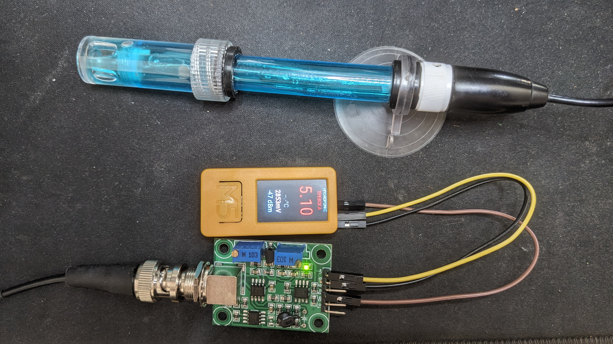

# HydroMonitor



pH-монитор гидропоники на **M5StickC Plus2** + **PH-4502C**.

Прошивка ESPHome с цветным дисплеем, расчётом pH, датчиком температуры и интеграцией в Home Assistant.

## Аппаратная часть

- **M5StickC Plus2** — ESP32, 1.14" ST7789V (135×240), кнопки GPIO37/39
- **PH-4502C** — интерфейсная плата pH-электрода
- **pH-электрод E-201-C** (BNC)
- **DS18B20** — OneWire на GPIO32 (будет добавлен)

### Подключение PH-4502C

| PH-4502C | M5StickC Plus2 |
|----------|---------------|
| VCC | 5V |
| GND | GND |
| Po | **GPIO36** (ADC1) |
| Do | не подключать |
| To | не подключать |

> ⚠️ **Важно:** GPIO36 = ADC1. Не используй GPIO26/27/25 — они на ADC2, который **блокируется WiFi** (error 263).

### Питание

M5StickC Plus2 **не имеет** микросхемы AXP192. При запуске прошивка устанавливает HIGH на GPIO4 (HOLD), иначе стик выключится через 2 секунды.

## Дисплей

Портретная ориентация (rotation=0), всё по центру:

```
         HYDROPONIC     ← cyan
           НОРМА        ← зелёный/жёлтый/красный
          5.91          ← pH, font 56, цвет от значения
         21.4°C         ← оранжевый
         2847mV         ← белый
        -51 dBm         ← cyan
```

Цвет pH и статус (НОРМА/ВНИМАНИЕ/ТРЕВОГА) меняются в зависимости от диапазона:

| Диапазон pH | Статус | Цвет |
|------------|--------|------|
| ≥ 5.7 | НОРМА | зелёный |
| 5.4–5.7 | ВНИМАНИЕ | жёлтый |
| < 5.4 | ТРЕВОГА | красный |

## Калибровка pH

Из даташита PH-4502C (E-201-C):

| pH | Выход (V) |
|----|----------|
| 4  | 3.071 |
| 7  | **2.535** |
| 10 | 2.066 |

- Midpoint (pH 7.0): **2535 mV**
- Slope: **167.5 mV/pH** (с учётом усиления платы, ~2.8× от Nernst)

Формула: `pH = 7.0 - (mV - 2535) / 167.5`

Параметры задаются в `substitutions` в `esphome/hydromonitor.yaml`:
```yaml
ph_cal_midpoint: "2535.0"
ph_cal_slope: "167.5"
```

Для точной калибровки — подставь свои значения после измерения в буферных растворах pH 4.0 и pH 7.0.

## Первая прошивка

1. Скопируй `esphome/secrets.example.yaml` в `esphome/secrets.yaml`
2. Впиши данные Wi-Fi
3. Открой проект в ESPHome dashboard
4. Установи `esphome/hydromonitor.yaml` по **USB**

После первой успешной прошивки обновления можно делать по OTA.

                                                 п.с. если чё это всё "сваял" Hermes agent, я тока проводочки вставил)
